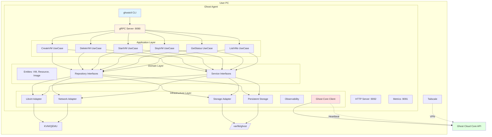

# Ghost Agent

Production-grade VM management daemon for Ghost Cloud.

## Features

- ✅ VM lifecycle management (create, start, stop, delete)
- ✅ KVM/Libvirt integration
- ✅ gRPC API with mTLS
- ✅ Resource monitoring and heartbeat
- ✅ Image caching
- ✅ Graceful shutdown
- ✅ Production-ready observability

## System Overview

Ghost Agent is a production-grade VM management daemon that runs on user PCs, managing virtual machines via KVM/Libvirt and communicating with Ghost Cloud Core.



---

## Quick Start

### Prerequisites

- Go 1.23+
- Libvirt/KVM installed
- Headscale/Tailscale configured

### Installation

```bash
# Build
make build

# Install
sudo make install

# Configure
sudo cp configs/agent.yaml /etc/ghost/agent.yaml
sudo vim /etc/ghost/agent.yaml  # Edit configuration

# Start service
sudo systemctl enable ghost-agent
sudo systemctl start ghost-agent

# Check status
sudo systemctl status ghost-agent
```

### Development

```bash
# Install dependencies
make deps

# Generate protobuf
make proto

# Run tests
make test

# Run linter
make lint

# Build
make build
```

## Architecture

Ghost Agent follows Clean Architecture with 4 layers:

1. **Domain** - Business entities and interfaces
2. **Application** - Use cases
3. **Infrastructure** - External adapters (Libvirt, API client)
4. **Presentation** - gRPC/HTTP servers

## Configuration

See `configs/agent.yaml` for configuration options.

## Documentation

- [Requirements](../docs/GHOST_AGENT_REQUIREMENTS.md)
- [Architecture](docs/ARCHITECTURE.md)
- [API Documentation](docs/API.md)

## License

MIT

## Future Features & Improvements

- **VM Snapshots & Cloning** - Save VM state and create copies for quick deployment
- **Live VM Migration** - Move running VMs between agents without downtime
- **Advanced Networking** - Tailscale subnet router, VXLAN, and WireGuard mesh for VM-to-VM communication
- **GPU Passthrough** - Direct GPU access for VMs requiring graphics acceleration
- **Cloud-init Templates** - Automated VM provisioning with custom configurations
- **Automated Backups** - Scheduled VM backups with point-in-time restore
- **Resource Quotas** - Per-user CPU, RAM, and disk limits
- **Auto-scaling** - Automatically start/stop VMs based on demand
- **Web UI Dashboard** - Browser-based management interface
- **ARM64 Support** - Run on Raspberry Pi and ARM-based systems
- **Container Runtime** - Support for Docker and Podman containers alongside VMs
- **Performance Analytics** - Detailed metrics and historical performance data
- **Automated OS Updates** - Keep VM operating systems up-to-date automatically
- **Firewall Management** - Per-VM firewall rules and network policies
- **High Availability** - Automatic failover and VM redundancy
- **External Storage** - NFS and Ceph integration for shared storage
- **Cost Tracking** - Monitor resource usage and calculate costs per VM
- **Advanced Security** - SELinux and AppArmor policy enforcement
- **VM Orchestration** - Complex workflows and dependencies between VMs
- **API Authentication** - Rate limiting, API keys, and OAuth support
