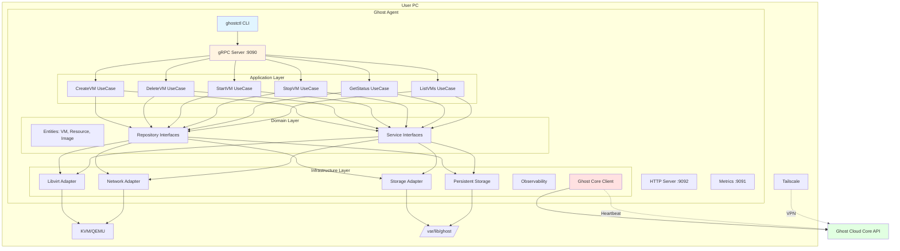
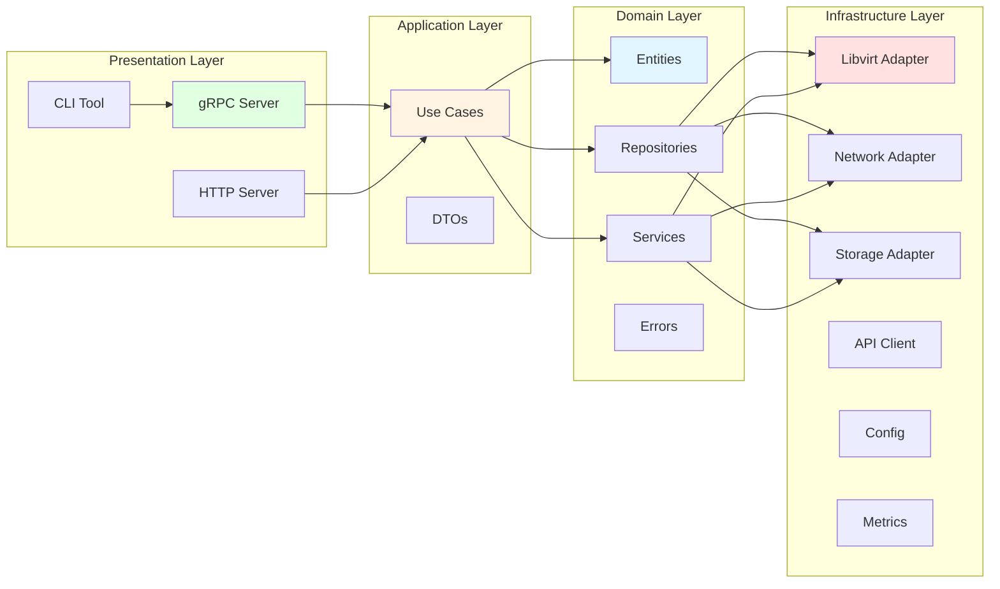
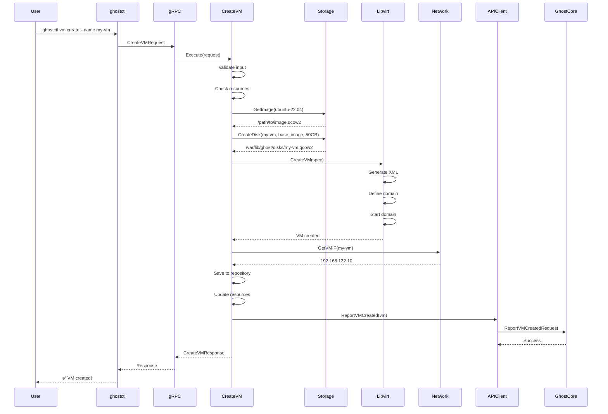
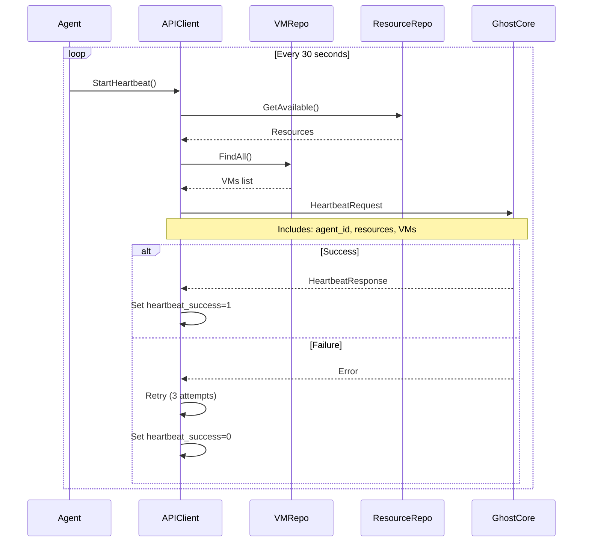
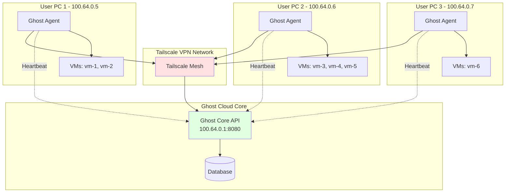
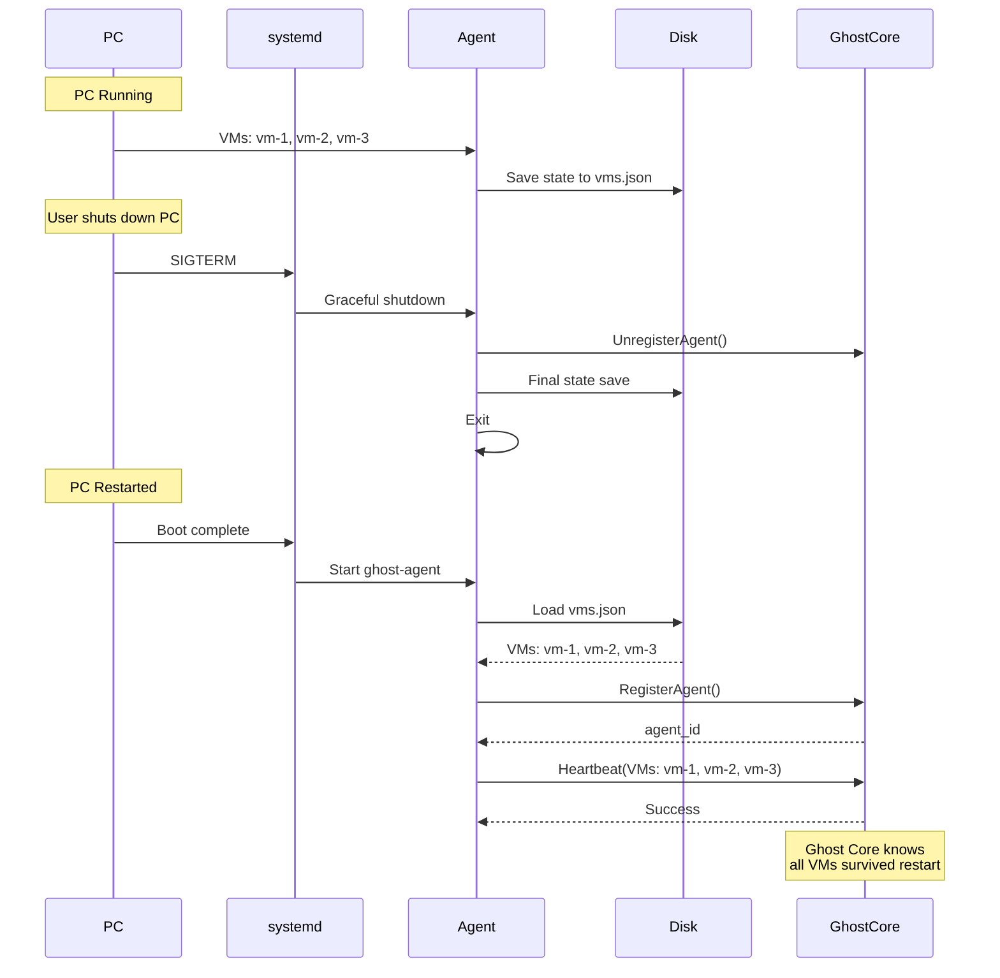
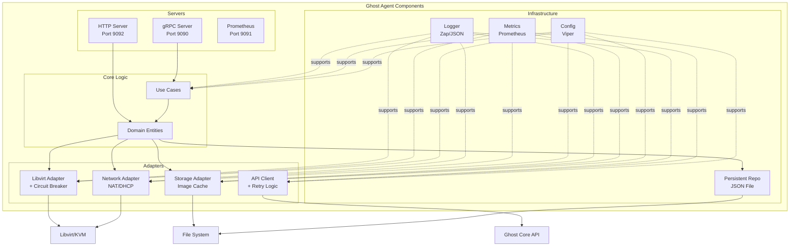
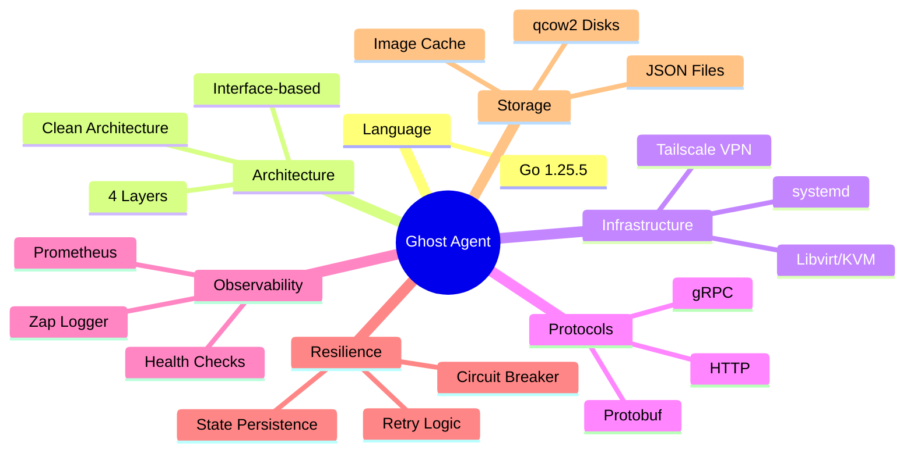
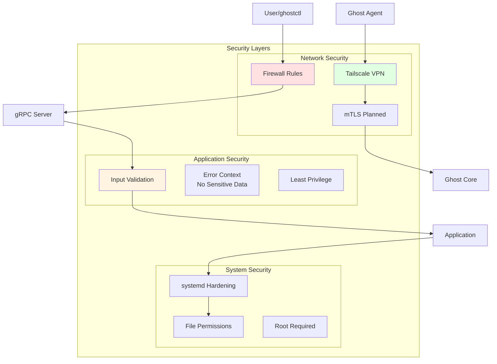

# Ghost Agent Architecture

## System Overview

Ghost Agent is a production-grade VM management daemon that runs on user PCs, managing virtual machines via KVM/Libvirt and communicating with Ghost Cloud Core.



---

## Clean Architecture Layers

Ghost Agent follows **Clean Architecture** principles with 4 distinct layers:



### Layer Responsibilities

**1. Domain Layer** (Core Business Logic)
- Entities: VM, Resource, Image
- Repository interfaces
- Service interfaces
- Domain errors
- **No dependencies on other layers**

**2. Application Layer** (Use Cases)
- CreateVM, DeleteVM, StartVM, StopVM, GetVMStatus, ListVMs
- DTOs for requests/responses
- Input validation
- Orchestrates domain + infrastructure

**3. Infrastructure Layer** (Adapters)
- Libvirt adapter (implements HypervisorService)
- Network adapter (implements NetworkService)
- Storage adapter (implements StorageService)
- Ghost Core API client
- Configuration, logging, metrics

**4. Presentation Layer** (Interfaces)
- gRPC server (receives commands)
- HTTP server (health, metrics)
- CLI tool (ghostctl)

---

## Data Flow

### VM Creation Flow



### Heartbeat Flow



---

## Deployment Architecture

### Single PC Deployment

```mermaid
graph TB
    subgraph "User PC"
        subgraph "systemd"
            SERVICE[ghost-agent.service]
        end
        
        subgraph "Ghost Agent Process"
            MAIN[main.go]
            GRPC[gRPC :9090]
            HTTP[Health :9092]
            METRICS[Metrics :9091]
        end
        
        subgraph "System Services"
            LIBVIRTD[libvirtd]
            TAILSCALED[tailscaled]
        end
        
        subgraph "Storage"
            CONFIG[/etc/ghost/agent.yaml]
            DATA[/var/lib/ghost/data/vms.json]
            IMAGES[/var/lib/ghost/images/]
            LOGS[/var/log/ghost/agent.log]
        end
        
        KVM[KVM/QEMU VMs]
    end
    
    INTERNET[Internet]
    GHOSTCORE[Ghost Cloud Core<br/>100.64.0.1:8080]
    
    SERVICE -->|starts| MAIN
    MAIN --> GRPC & HTTP & METRICS
    MAIN --> LIBVIRTD & TAILSCALED
    MAIN --> CONFIG & DATA & IMAGES & LOGS
    LIBVIRTD --> KVM
    TAILSCALED --> INTERNET
    MAIN -.Heartbeat.-> GHOSTCORE
    TAILSCALED -.VPN.-> GHOSTCORE
    
    style SERVICE fill:#e1f5ff
    style MAIN fill:#fff4e1
    style GHOSTCORE fill:#e1ffe1
```

### Multi-Agent Deployment



---

## State Persistence

### PC Restart Flow



---

## Component Diagram



---

## Technology Stack



---

## Security Architecture



---

## Performance Characteristics

- **VM Creation Time:** 30-60 seconds (depends on image download)
- **VM Start Time:** 5-10 seconds
- **VM Stop Time:** 5-15 seconds (graceful) / 1-2 seconds (force)
- **Heartbeat Interval:** 30 seconds
- **API Response Time:** < 100ms (except VM creation)
- **Memory Usage:** ~50MB (idle) / ~100MB (active)
- **CPU Usage:** < 1% (idle) / 5-10% (during VM operations)

---

## Scalability

- **VMs per Agent:** Limited by PC resources (typically 5-20 VMs)
- **Agents per Core:** Unlimited (tested up to 100)
- **Concurrent Operations:** Thread-safe, supports parallel VM operations
- **State Size:** ~1KB per VM (JSON storage)

---

## Future Architecture Enhancements

1. **Advanced Networking**
   - Replace NAT with Tailscale subnet router
   - VXLAN for VM-to-VM communication
   - WireGuard mesh networking

2. **High Availability**
   - VM migration between agents
   - Automatic failover
   - Distributed state

3. **Enhanced Security**
   - mTLS for all communications
   - API key authentication
   - Secrets management (Vault)

4. **Monitoring**
   - Grafana dashboards
   - Alert manager integration
   - Distributed tracing (OpenTelemetry)
